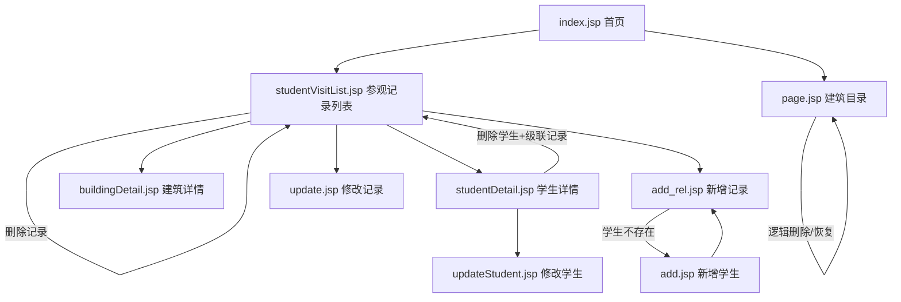

# OracleProject — 古建筑参观管理系统

## 项目简介

基于 **Java + Spring MVC + MyBatis + Oracle** 的 Web 应用，用于管理山西省古建筑信息、学生信息，以及学生参观古建筑的评分记录。前端以 **JSP + JSTL** 为主，部分增删改通过 **REST + JSON（FastJSON）** 与后端交互。

- **构建工具**：Maven（`packaging: war`）
- **部署产物**：`OracleProject.war`
- **默认首页**：`index.jsp`

---

## 1. 代码结构

### 1.1 目录树（源码）

```
OracleProject/
├── pom.xml                          # Maven 依赖与打包配置
├── PROJECT_OVERVIEW.md              # 本文档
└── src/main/
    ├── java/com/oracleproject/
    │   ├── controller/              # 控制层（页面跳转 + REST 接口）
    │   │   ├── PageController.java          # 建筑分页列表、删除、恢复
    │   │   ├── BuildingController.java      # 建筑详情
    │   │   ├── StudentVisitController.java  # 参观记录列表、删除记录
    │   │   ├── StudentController.java       # 学生详情、删除学生
    │   │   ├── StudentPageController.java   # 跳转修改学生页面
    │   │   ├── AddController.java           # 新增学生（REST）
    │   │   └── RelController.java           # 参观记录增改、学生信息修改（REST）
    │   ├── service/                 # 业务层
    │   │   ├── PageService.java
    │   │   ├── BuildingService.java
    │   │   ├── StudentService.java
    │   │   ├── StudentVisitService.java
    │   │   └── AddService.java
    │   ├── mapper/                  # MyBatis Mapper 接口
    │   │   ├── PageMapper.java
    │   │   ├── BuildingMapper.java
    │   │   ├── StudentMapper.java
    │   │   ├── StudentVisitMapper.java
    │   │   └── AddMapper.java
    │   ├── model/                   # 实体类（对应数据库表）
    │   │   ├── Student.java
    │   │   ├── Building.java
    │   │   └── StudentBuildingRel.java
    │   ├── vo/                      # 视图/查询对象
    │   │   ├── VisitQueryVO.java    # 参观记录查询条件
    │   │   └── StudentVisitVO.java  # 参观记录列表展示
    │   └── utils/
    │       ├── PageBean.java        # 分页封装
    │       └── Result.java          # 统一 JSON 响应
    ├── resources/
    │   ├── jdbc.properties          # 数据库连接配置
    │   ├── spring.xml               # 根容器：数据源、MyBatis、Service 扫描
    │   ├── springmvc.xml            # MVC：Controller 扫描、视图解析、JSON 转换
    │   └── com/oracleproject/mapper/
    │       ├── PageMapper.xml
    │       ├── BuildingMapper.xml
    │       ├── StudentMapper.xml
    │       ├── StudentVisitMapper.xml
    │       └── AddMapper.xml
    └── webapp/
        ├── WEB-INF/web.xml          # 编码过滤器、Spring 监听器、DispatcherServlet
        ├── index.jsp                # 系统首页（功能入口）
        ├── studentVisitList.jsp     # 学生参观记录列表
        ├── studentDetail.jsp        # 学生详情
        ├── updateStudent.jsp        # 修改学生信息
        ├── buildingDetail.jsp       # 建筑详情
        ├── page.jsp                 # 建筑分页目录
        ├── add.jsp                  # 新增学生
        ├── add_rel.jsp              # 新增参观记录
        └── update.jsp               # 修改参观记录
```

### 1.2 分层架构

| 层级 | 职责 | 典型类 |
|------|------|--------|
| **Controller** | 接收 HTTP 请求，返回 JSP 视图名或 JSON | `StudentVisitController`、`RelController` |
| **Service** | 业务逻辑、事务（如级联删除） | `StudentService`、`PageService` |
| **Mapper** | 数据库访问（MyBatis） | `StudentVisitMapper` + `*.xml` |
| **Model / VO** | 实体与查询/展示对象 | `Student`、`VisitQueryVO` |
| **View** | JSP 页面渲染 | `studentVisitList.jsp` |

### 1.3 技术栈与配置

| 组件 | 版本/说明 |
|------|-----------|
| Spring / Spring MVC | 5.3.39 |
| MyBatis + mybatis-spring | 3.4.6 / 2.0.6 |
| Oracle JDBC (ojdbc6) | 11.2.0.4 |
| Druid 连接池 | 1.2.20 |
| FastJSON | REST 接口 JSON 序列化 |
| JSTL | JSP 标签与循环展示 |

**Spring 双容器**：

- `ContextLoaderListener` 加载 `spring.xml`（数据源、SqlSessionFactory、Mapper 扫描、Service）
- `DispatcherServlet` 加载 `springmvc.xml`（Controller、视图解析器、静态资源）

### 1.4 数据库表（业务相关）

| 表名 | 说明 | 逻辑删除字段 |
|------|------|----------------|
| `shanxi_ancient_student` | 学生 | `is_delete` |
| `sx_ancient_buildings` | 古建筑 | `is_deleted` |
| `student_build_rel` | 学生-建筑参观关联（评分、参观时间） | `is_delete` |

---

## 2. 功能与页面对照总览

### 2.1 页面清单

| 页面文件 | 访问方式 | 说明 |
|----------|----------|------|
| `index.jsp` | `/` 或 `/index.jsp` | 系统首页，功能导航 |
| `studentVisitList.jsp` | `GET /visit/list` | 学生参观记录列表（核心列表页） |
| `studentDetail.jsp` | `GET /student/detail/{sid}` | 学生详情 |
| `updateStudent.jsp` | `GET /student/toUpdatePage?sid=` | 修改学生信息（数据回显） |
| `buildingDetail.jsp` | `GET /building/detail/{id}` | 古建筑详情 |
| `page.jsp` | `GET /building/page?pageNum=` | 古建筑分页目录 |
| `add.jsp` | 直接访问 JSP | 新增学生（AJAX → REST） |
| `add_rel.jsp` | 直接访问 JSP | 新增参观记录（AJAX → REST） |
| `update.jsp` | 直接访问 JSP（带 `relId` 参数） | 修改参观记录（AJAX → REST） |

### 2.2 REST 接口清单（无独立页面，供 JSP AJAX 调用）

| 方法 | 路径 | 说明 |
|------|------|------|
| POST | `/student/add` | 新增学生；若学号曾逻辑删除则恢复并更新 |
| POST | `/rel/add` | 新增参观记录（校验学生存在、建筑 ID 1–103） |
| POST | `/rel/update` | 修改参观记录 |
| POST | `/rel/updateStudent` | 修改学生信息 |

### 2.3 控制器路由一览

| 模块 | 路径前缀 | 控制器 |
|------|----------|--------|
| 参观记录 | `/visit` | `StudentVisitController` |
| 学生 | `/student` | `StudentController`、`StudentPageController`、`AddController` |
| 建筑 | `/building` | `PageController`、`BuildingController` |
| 关联记录 API | `/rel` | `RelController` |

---

## 3. 功能详细说明

### 3.1 系统首页

- **页面**：`index.jsp`
- **功能**：提供两个入口卡片
  - 学生参观记录管理 → `/visit/list`
  - 建筑目录 → `/building/page`

---

### 3.2 学生参观记录列表（你列出的功能 1）

- **页面**：`studentVisitList.jsp`
- **控制器**：`StudentVisitController#list` → `GET /visit/list`
- **服务**：`StudentVisitService.findVisitList(VisitQueryVO)`

#### 多条件查询（模糊/筛选）

查询对象 `VisitQueryVO` 绑定 GET 参数，SQL 见 `StudentVisitMapper.xml`：

| 条件 | 参数名 | 实现说明 |
|------|--------|----------|
| 学生姓名或建筑名称 | `keyword` | `sname` 或 `building_name` 的 `LIKE '%关键字%'` |
| 专业 | `classname` | `stu.classname LIKE '%专业%'`（下拉：软工、计科、电建等） |
| 城市（area_code 前缀） | `areaCode` | `build.area_code LIKE #{areaCode}`，如 `1401%` 表示太原市 |
| 日期 | `visitTime` | `trunc(rel.visit_time) = trunc(#{visitTime})` |

**附加过滤**：仅展示 `rel.is_delete=0` 且 `stu.is_delete=0` 且 `build.is_deleted=0` 的有效数据。

#### 列表展示与跳转

- 展示：记录 ID、学号、姓名、专业、建筑 ID、建筑名称、参观时间、评分
- 学生姓名 → `/student/detail/{sid}`
- 建筑名称 → `/building/detail/{buildId}`

#### 列表页其他操作

- **添加记录**：跳转 `add_rel.jsp`
- **返回首页**：`index.jsp`
- **删除记录**：见 3.3
- **更新记录**：跳转 `update.jsp?relId=`

---

### 3.3 参观记录逻辑删除（你列出的功能 3）

- **入口**：列表页「删除」按钮
- **路径**：`GET /visit/deleteRel/{relId}`
- **实现**：`update student_build_rel set is_delete = 1 where rel_id = ?`
- **删除后**：重定向回 `/visit/list`

---

### 3.4 学生详情页（你列出的功能 4）

- **页面**：`studentDetail.jsp`
- **路径**：`GET /student/detail/{sid}`
- **展示**：学号、姓名、性别（0 女 / 1 男）、专业
- **操作**：
  - **修改学生信息** → `/student/toUpdatePage?sid=`
  - **删除学生** → `/student/delete/{sid}`（见 3.5、3.6）
  - **返回列表** → `/visit/list`

---

### 3.5 学生逻辑删除（你列出的功能 5）

- **路径**：`GET /student/delete/{sid}`
- **实现**：`StudentMapper.deleteStudent` → `shanxi_ancient_student.is_delete = 1`
- **事务**：`StudentService.deleteStudent` 使用 `@Transactional`
- **删除后**：重定向 `/visit/list`

---

### 3.6 删除学生时级联逻辑删除参观记录（你列出的功能 6）

- 与 3.5 同一接口内完成
- **实现**：`StudentMapper.deleteStudentRel` → 将该 `sid` 下所有 `student_build_rel` 记录的 `is_delete` 置为 1
- **顺序**：先删学生，再级联删关联记录（同一事务）

---

### 3.7 建筑详情页（你列出的功能 7）

- **页面**：`buildingDetail.jsp`
- **路径**：`GET /building/detail/{id}`
- **展示**：建筑 ID、地区编码、地区名称、建筑名称、地址、建造年代、保护等级、建筑类型、简介
- **条件**：仅查询 `is_deleted = 0` 的建筑

---

### 3.8 其他功能（除你列出项外）

#### 3.8.1 新增学生

- **页面**：`add.jsp`
- **接口**：`POST /student/add`（`AddController`）
- **逻辑**：
  - 学号不存在 → 插入新学生
  - 学号存在但已逻辑删除 → 将 `is_delete` 置 0 并更新信息（“复活”）
- **成功后**：可跳转 `add_rel.jsp` 继续添加参观记录

#### 3.8.2 修改学生信息

- **页面**：`updateStudent.jsp`（由详情页或 `StudentPageController` 回显数据）
- **接口**：`POST /rel/updateStudent`
- **校验**：学号有效、学生必须存在

#### 3.8.3 新增参观记录

- **页面**：`add_rel.jsp`
- **接口**：`POST /rel/add`
- **校验**：
  - 学生必须存在
  - 建筑 ID 必须在 1–103 之间
- **失败处理**：若提示“学生不存在”，自动跳转 `add.jsp`

#### 3.8.4 修改参观记录

- **页面**：`update.jsp`（从列表带 `relId` 进入，仅自动回填记录 ID）
- **接口**：`POST /rel/update`
- **校验**：学号存在、建筑 ID 1–103

#### 3.8.5 古建筑分页目录

- **页面**：`page.jsp`
- **路径**：`GET /building/page?pageNum=`（默认第 1 页）
- **分页**：每页 6 条，Oracle `ROWNUM` 分页；支持首页/上一页/下一页/尾页/页码跳转
- **展示字段**：所属地区、建筑名称、建造年代、保护等级、建筑介绍

#### 3.8.6 古建筑逻辑删除

- **路径**：`GET /building/delete?id=`
- **实现**：`sx_ancient_buildings.is_deleted = 1`
- **入口**：分页列表每行「删除」按钮

#### 3.8.7 古建筑逻辑删除恢复

- **路径**：`GET /building/restore?id=`
- **实现**：`is_deleted = 0`
- **展示规则**：仅在**分页最后一页**底部展示「已删除数据（可恢复）」表格及恢复按钮

---

## 4. 功能关系图



---

## 5. 逻辑删除策略汇总

| 对象 | 字段 | 删除接口 | 级联/恢复 |
|------|------|----------|-----------|
| 参观记录 | `student_build_rel.is_delete` | `/visit/deleteRel/{relId}` | 无 |
| 学生 | `shanxi_ancient_student.is_delete` | `/student/delete/{sid}` | 级联删除该学生全部参观记录 |
| 古建筑 | `sx_ancient_buildings.is_deleted` | `/building/delete` | 支持 `/building/restore` 恢复 |

列表与详情查询均过滤已删除数据（`is_delete/is_deleted = 0`）。

---

## 6. 统一响应格式（REST）

`Result` 类结构：

```json
{
  "code": 200,
  "msg": "操作成功",
  "data": null
}
```

- `code = 200`：成功
- `code = 500`：失败，`msg` 为错误说明

---

## 7. 本地运行提示

1. 配置 `src/main/resources/jdbc.properties` 中的 Oracle 连接信息
2. 执行 `mvn clean package`，将 `target/OracleProject.war` 部署到 Tomcat 等 Servlet 容器
3. 访问 `http://localhost:端口/OracleProject/`（上下文路径以实际部署为准）

---

*文档根据当前仓库源码整理，如有新增接口或页面请同步更新本文档。*
